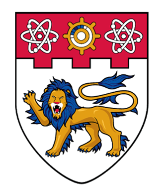
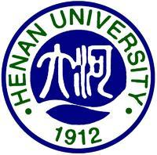

Education
======
<table>
  <tbody>
    <tr>
    <td>
       
    </td>
    <td align="left">
      <pre>
      <b>Nanyang Technologitical University</b>
      M.S., Master of Computer Contorl & Automation
      Nanyang Technologitical University (Singapore)
      August, 2024 -- Sep, 2026 (expected)
      </pre>
    </td>
    </tr>
    <tr>
    <td>
     
    </td>
    <td align="left">
      <pre>
      <b>Henan University</b>
      B.S., Department of Information Technology
      Melbourne (Australia)
      Sep, 2020 -- Jun, 2024
      </pre>
    </td>
    </tr>
    <tr>
    <td>
       
    </td>
    <td align="left">
      <pre> 	
     <b>Victoria University</b>  
     B.S., Department of Information Technology  
     Melbourne (Australia)  
     Sep, 2020 -- Jun, 2024  
      </pre>
    </td>
    </tr>
  </tbody>
</table>

Work experience
======
<pre>
<b>Spring 2024: Customization Engineer (intern)</b>
  * Shenzhen Juding Medical Co., LTD
  <b>(Top 10 Healthcare Innovative Payment Companies in China 2021)</b>
  * Duties includes: Data analysis about the patient in medical field, 
  and coding medical systems according to the needs of cutomers
  * Supervisor: Chong Li
  
</pre>
Project
======

Service and leadership
======
<b>Spring 2022: Huawei Cloud AI volunteer</b>
