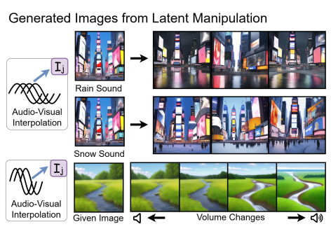

<h1>Publications & Manuscripts</h1>

<h3>Preprints</h3>
<table>
  <tbody>
    <tr>
    <td>
       
    </td>
    <td align="left">
      <pre>
      <b>Bridging the Gap between Text, Audio, Image, and Any Sequence: A Novel Approach using Gloss-based Annotation</b>
      Sen Fang, Yalin Feng, Sizhou Chen, Xiaofeng Zhang, Teik Toe Teoh†
      Preprint'24
      </pre>
    </td>
    </tr>
  </tbody>
</table>